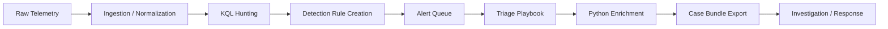
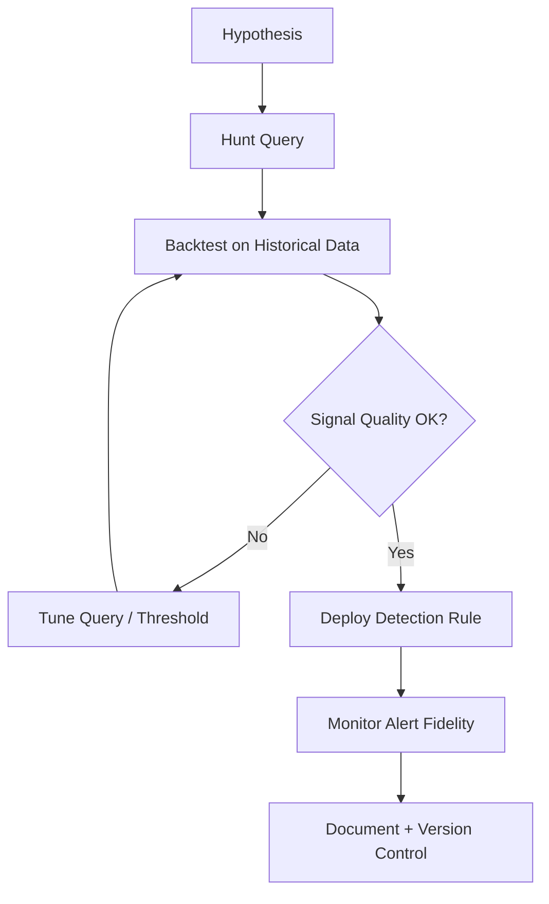
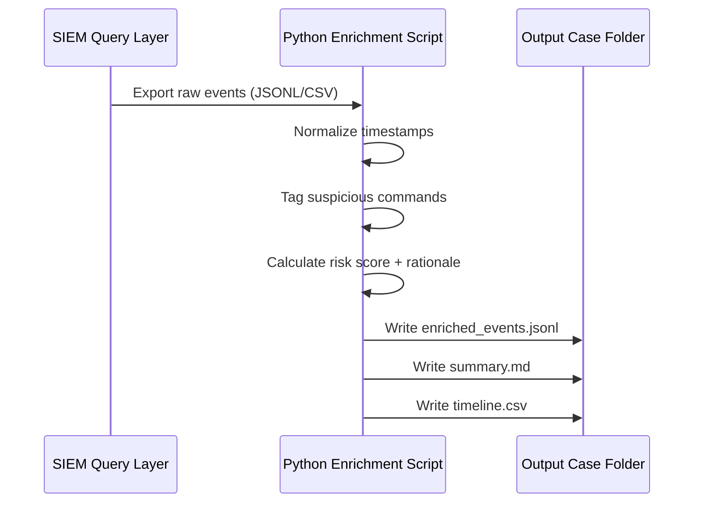

# SIEM Engineering Lab (KQL + Python)


A **fully documented, end-to-end SIEM engineering lab guide** for:

- Detection engineering with KQL
- Threat hunting and triage workflows
- Python-based event enrichment
- Repeatable case packaging and SOC-ready evidence output

---

## Table of Contents

1. [What This Lab Covers](#what-this-lab-covers)
2. [Lab Outcomes](#lab-outcomes)
3. [Reference Architecture](#reference-architecture)
4. [Workflow Diagrams](#workflow-diagrams)
5. [Prerequisites](#prerequisites)
6. [Repository Layout](#repository-layout)
7. [Quick Start (Runnable)](#quick-start-runnable)
8. [Step-by-Step Lab Instructions](#step-by-step-lab-instructions)
9. [Detection Engineering Guidance](#detection-engineering-guidance)
10. [Triage Playbook Guidance](#triage-playbook-guidance)
11. [Automation Guidance (Python)](#automation-guidance-python)
12. [Validation Checklist](#validation-checklist)
13. [Troubleshooting](#troubleshooting)
14. [Security & Privacy Notes](#security--privacy-notes)
15. [Comprehensive Resource Links](#comprehensive-resource-links)
16. [License](#license)

---

## What This Lab Covers

This project models a realistic SOC workflow:

**Baseline → Hunt → Detect → Triage → Enrich → Export Evidence**

The lab is platform-aligned with:

- [Microsoft Sentinel](https://learn.microsoft.com/azure/sentinel/overview)
- [Microsoft Defender XDR Advanced Hunting](https://learn.microsoft.com/defender-xdr/advanced-hunting-overview)
- Any environment that supports KQL-style analytics

---

## Lab Outcomes

By completing this lab, you will be able to:

1. Build baseline telemetry understanding for user and host behavior.
2. Write focused KQL hunts for authentication and process activity.
3. Convert hunts into operational detections with clear threshold logic.
4. Enrich raw events with Python (tagging, scoring, normalization).
5. Export a consistent, analyst-friendly case bundle for investigations.

---

## Reference Architecture

```text
Telemetry Sources (EDR, Auth, Process, Network)
             |
             v
      SIEM / Data Lake
             |
             v
      KQL Hunt Queries
             |
             v
      Detection Rules
             |
             v
      Triage Workflow
             |
             v
 Python Enrichment + Case Export
```

---

## Workflow Diagrams

### 1) End-to-End SOC Pipeline



### 2) Detection Content Lifecycle



### 3) Case-Bundle Data Flow



---

## Prerequisites

- Access to a KQL-capable platform (Sentinel/Defender preferred)
- Python **3.10+**
- Optional: virtual environment tooling (`venv`)
- Analyst permissions to run queries and export results

Install Python dependencies (when `requirements.txt` exists):

```bash
pip install -r requirements.txt
```

---

## Repository Layout

> This README describes the target structure for a complete lab implementation.

```text
SIEM-Engineering-Lab/
├── README.md
├── kql/
│   ├── baseline.kql
│   ├── auth_hunt.kql
│   ├── process_hunt.kql
│   └── persistence_hunt.kql
├── scripts/
│   ├── enrich_events.py
│   └── export_case_bundle.py
├── data/
│   └── sample_events.jsonl
├── docs/
│   ├── triage-playbook.md
│   ├── detection-template.md
│   └── evidence-checklist.md
└── outputs/
```

---

## Quick Start (Runnable)

If you are starting from only this README, use this bootstrap to create a working scaffold:

```bash
mkdir -p kql scripts data docs outputs

cat > kql/baseline.kql <<'KQL'
DeviceLogonEvents
| where Timestamp > ago(7d)
| summarize Logons=count() by DeviceName, AccountName, LogonType
| order by Logons desc
KQL

cat > kql/auth_hunt.kql <<'KQL'
DeviceLogonEvents
| where Timestamp > ago(14d)
| where LogonType in ("RemoteInteractive", "Interactive")
| summarize LoginCount=count() by AccountName, DeviceName, RemoteIP
| order by LoginCount desc
KQL

cat > kql/process_hunt.kql <<'KQL'
DeviceProcessEvents
| where Timestamp > ago(14d)
| where FileName in ("arp.exe", "net.exe", "whoami.exe", "ipconfig.exe", "nltest.exe")
| project Timestamp, DeviceName, AccountName, FileName, ProcessCommandLine
| order by Timestamp desc
KQL

cat > data/sample_events.jsonl <<'JSONL'
{"timestamp":"2026-01-18T10:01:10Z","device":"ENG-WS-01","user":"alice","command":"whoami","ip":"10.1.2.3"}
{"timestamp":"2026-01-18T10:02:11Z","device":"ENG-WS-01","user":"alice","command":"ipconfig /all","ip":"10.1.2.3"}
{"timestamp":"2026-01-18T10:04:00Z","device":"ENG-WS-02","user":"svc_backup","command":"net user","ip":"185.211.4.10"}
JSONL
```

---

## Step-by-Step Lab Instructions

### Step 1 — Establish Baseline

Purpose: identify what “normal” looks like for users, devices, and logon patterns.

Example query:

```kql
DeviceLogonEvents
| where Timestamp > ago(7d)
| summarize Logons=count() by DeviceName, AccountName, LogonType
| order by Logons desc
```

What to look for:

- Top accounts by volume
- Typical workstation-to-user relationships
- Administrative/service account usage
- Interactive vs remote login balance

---

### Step 2 — Hunt Authentication Anomalies

```kql
DeviceLogonEvents
| where Timestamp > ago(14d)
| where LogonType in ("RemoteInteractive", "Interactive")
| summarize LoginCount=count(), FirstSeen=min(Timestamp), LastSeen=max(Timestamp) by AccountName, DeviceName, RemoteIP
| order by LoginCount desc
```

Add tuning ideas:

- Suppress known jump hosts
- Exclude approved VPN egress IPs
- Focus on privileged identities first

---

### Step 3 — Hunt Discovery & Enumeration Behavior

```kql
DeviceProcessEvents
| where Timestamp > ago(14d)
| where FileName in ("arp.exe", "net.exe", "whoami.exe", "ipconfig.exe", "nltest.exe")
| project Timestamp, DeviceName, AccountName, FileName, ProcessCommandLine, InitiatingProcessFileName
| order by Timestamp desc
```

Why this matters:

- Common recon commands appear in many intrusion playbooks.
- Context (parent process, account type, host role) determines severity.

---

### Step 4 — Convert Hunt to Detection Rule

For each production rule, document:

- **Rule goal**: what behavior is being detected
- **Query**: final tuned KQL
- **Frequency / lookback**: e.g., every 15 minutes over 1 hour
- **Thresholds**: trigger conditions and rationale
- **Entity mapping**: account, host, IP, process
- **False positive notes**: known benign causes
- **Triage steps**: analyst instructions

---

### Step 5 — Enrich Events with Python

Intended command pattern:

```bash
python scripts/enrich_events.py \
  --input data/sample_events.jsonl \
  --output outputs/enriched_events.jsonl
```

Suggested enrichment fields:

- `normalized_timestamp`
- `command_tags` (e.g., discovery, credential_access)
- `risk_score` (0–100)
- `explanation` (human-readable reason)
- `source_case_id` (for tracking)

---

### Step 6 — Export Case Bundle

Intended command pattern:

```bash
python scripts/export_case_bundle.py \
  --input outputs/enriched_events.jsonl \
  --case CASE-001 \
  --out outputs/CASE-001/
```

Recommended outputs:

- `enriched_events.jsonl`
- `summary.md`
- `timeline.csv`
- `evidence-checklist.md`
- `query-pack.md`

---

## Detection Engineering Guidance

Use these practices to improve alert quality:

1. **Start broad, then tune** — avoid overfitting early.
2. **Backtest** on at least 14–30 days of data.
3. **Anchor thresholds** to baseline percentiles.
4. **Map to ATT&CK** techniques for communication consistency.
5. **Version control all rules** and maintain changelogs.

Example ATT&CK mappings for this lab:

- Discovery: [T1082 System Information Discovery](https://attack.mitre.org/techniques/T1082/)
- Account Discovery: [T1087](https://attack.mitre.org/techniques/T1087/)
- Remote Services: [T1021](https://attack.mitre.org/techniques/T1021/)

---

## Triage Playbook Guidance

When an alert triggers:

1. Confirm entity integrity (user, host, source IP, time window).
2. Pull adjacent telemetry (preceding/following 30–60 minutes).
3. Validate account intent (change ticket, admin task, automation).
4. Classify severity and confidence.
5. Escalate or close with explicit rationale.

Minimum case notes should include:

- Alert ID and rule version
- Scope and impacted assets
- Key evidence rows
- Analyst decision and next actions

---

## Automation Guidance (Python)

Strong implementation recommendations:

- Parse as newline-delimited JSON (JSONL) for streaming workflows.
- Keep enrichment deterministic for reproducibility.
- Produce both machine-readable and analyst-readable outputs.
- Include unit tests for scoring and tag rules.
- Add schema validation before exporting bundles.

---

## Validation Checklist

Use this checklist before declaring the lab complete:

- [ ] Baseline query executed and documented
- [ ] Auth hunt query tuned and validated
- [ ] Process hunt query tuned and validated
- [ ] At least one hunt converted into a scheduled rule
- [ ] Triage playbook completed for one simulated incident
- [ ] Enrichment output includes tags, score, and rationale
- [ ] Case bundle generated and reviewable by another analyst

---

## Troubleshooting

### Query returns no results

- Expand time range from 24h → 7d/14d.
- Verify table names match your environment schema.
- Remove overly strict filters and reintroduce gradually.

### High false positives

- Add environment-specific allowlists.
- Scope to high-value assets/users.
- Increase threshold after baseline analysis.

### Python pipeline fails

- Validate JSONL formatting (one JSON object per line).
- Check file paths and output directory permissions.
- Confirm Python version and installed dependencies.

---

## Security & Privacy Notes

- Do not store production secrets/tokens in repo files.
- Redact usernames, hostnames, IPs, and tenant identifiers before sharing artifacts.
- Treat exported case bundles as sensitive investigation material.

---

## Comprehensive Resource Links

### Core Platforms

- Microsoft Sentinel Overview: https://learn.microsoft.com/azure/sentinel/overview
- Sentinel KQL Tutorial: https://learn.microsoft.com/azure/data-explorer/kusto/query/tutorial
- Defender XDR Advanced Hunting: https://learn.microsoft.com/defender-xdr/advanced-hunting-overview
- Advanced Hunting Schema Reference: https://learn.microsoft.com/defender-xdr/advanced-hunting-schema-tables

### KQL Reference

- KQL language reference: https://learn.microsoft.com/azure/data-explorer/kusto/query/
- `summarize` operator: https://learn.microsoft.com/azure/data-explorer/kusto/query/summarize-operator
- `project` operator: https://learn.microsoft.com/azure/data-explorer/kusto/query/project-operator
- `join` operator: https://learn.microsoft.com/azure/data-explorer/kusto/query/join-operator

### Detection & Threat Frameworks

- MITRE ATT&CK: https://attack.mitre.org/
- NIST Cybersecurity Framework: https://www.nist.gov/cyberframework
- Sigma rules (generic detection format): https://github.com/SigmaHQ/sigma

### Incident Response & SOC Operations

- NIST SP 800-61 (Incident Handling): https://csrc.nist.gov/publications/detail/sp/800-61/rev-2/final
- CISA Incident Response Resources: https://www.cisa.gov/topics/cyber-threats-and-advisories/incident-response
- SANS Incident Handler’s Handbook (overview): https://www.sans.org/white-papers/33901/

### Python & Data Handling

- Python argparse docs: https://docs.python.org/3/library/argparse.html
- Python `json` docs: https://docs.python.org/3/library/json.html
- pandas docs (optional): https://pandas.pydata.org/docs/

---

## License

MIT
